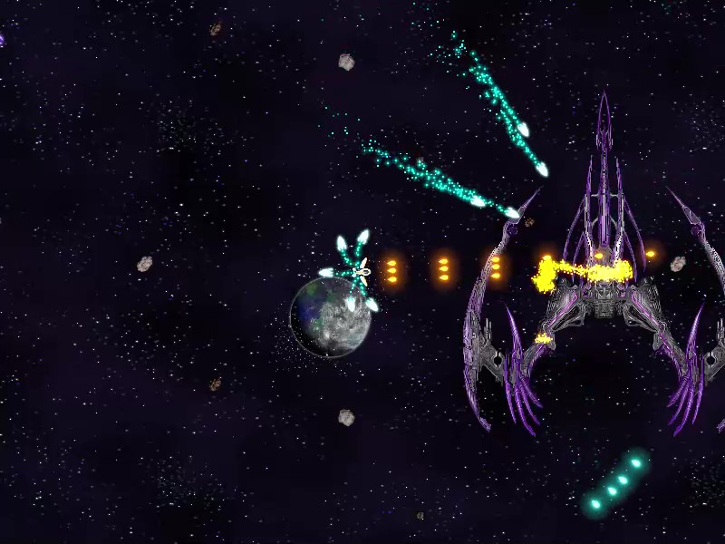
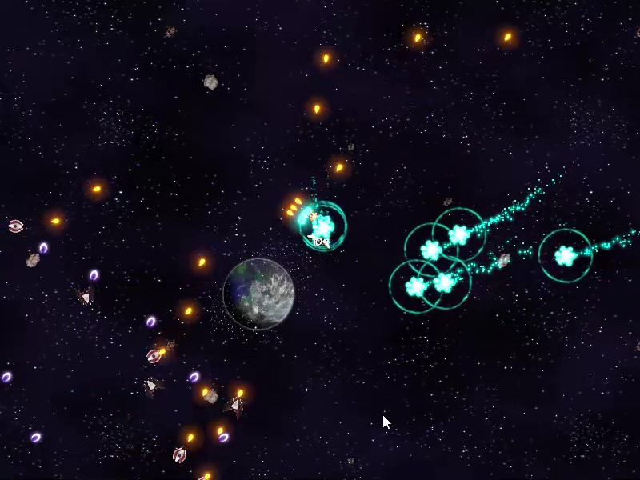

# Space shooter

This project is to help me learn wgpu and gain more confidence with Rust.




## Controls

**A/S/D/W** Move Left, Down, Right, Up
**F** Fire
**V** Evade

## Features

- Particle System
- Post processing bloom Effect (particles)
- Multiple Weapons
- Parallax
- And more...

## Building

Run the following command

```
$ cargo run
```

## TODO

1. Evasion power-up does not work very well.
2. The simulation params buffer (particle system) never claims the memory unused, it ends up using too much memory.
3. Indirect render particles.
4. Add more levels (it actually has no levels).
5. Full screen (it's 800x600 now).
